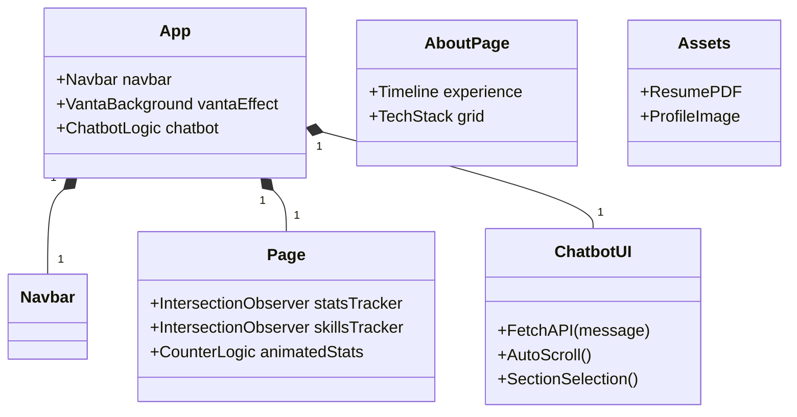

# 🚀 Sumiksh Portfolio

A modern, theme-aware portfolio built with **Next.js**, **Tailwind CSS**, and **shadcn/ui**.

## 🗂️ UML Diagram (Mermaid)



## ✨ Features

- 📱 **Responsive landing page** with animated profile photo  
- 🌗 **Global dark/light theme toggle**  
- 🧭 **Navigation bar** with Home, About, and Experience pages  
- 🤖 **Chatbot UI** for resume Q&A  
- 🖼️ **Portfolio cards** with interactive hover effects  

---

## 📄 Pages

🏠 Main Home Page [src/app/page.js]
- Vanta.js Immersive Background: Features the "Trunk" effect powered by three.js and p5.js. It creates an interactive, organic web of lines that responds to mouse movement and touch.

- Theme-Reactive Visuals: The Vanta effect is tightly coupled with the resolvedTheme. It dynamically updates hex colors for both the lines (0x9333ea for dark, 0x4338ca for light) and the background to ensure a seamless transition between light and dark modes.

- Optimized Performance: Uses useRef and a mounted state check to initialize the canvas only on the client side, preventing server-side rendering errors and ensuring smooth frame rates.

- Animated Profile & Stats: Combines CSS transitions for the profile image with IntersectionObserver logic to trigger "count-up" animations for your project and experience totals.

👤 About Page [src/app/aboutpage/page.js]
- Tech Stack Visualization: A grid of technical competencies featuring animated progress bars.

- Visibility Tracking: Implements skillsRef to trigger skill bar filling animations only when the user reaches the section.

- Personal Overview: Detailed breakdown of professional background and interests.

💼 Experience Page [src/app/experiencepage/page.js]
- Professional Timeline: A chronological display of work history and roles.

- Interactive UI: Uses Tailwind’s group-hover effects to provide tactile feedback as users explore your career path.

- Three js: To display the background mouse image 

🧩 Navbar [src/components/ui/navbar.js]
- Smart Navigation: A sticky, responsive header that adapts its transparency and border colors based on the theme.

- Theme Controller: The central hub for switching the site's visual mode, which automatically signals the Vanta.js background to re-render.

---

## 🎨 Theming

- Uses `next-themes` and **shadcn/ui** for dynamic dark/light mode  
- All colors and backgrounds adapt automatically

---

## 🛠️ Getting Started

1. **Install dependencies:**
   ```bash
   npm install
   ```
2. **Run the development server:**
   ```bash
   npm run dev
   ```
3. **Visit:** [http://localhost:3000](http://localhost:3000)

---

## 🧑‍💻 Customization

- Update profile photo in `public/profile.jpg`
- Edit resume data in `src/app/api/chat/route.js`
- Change theme colors in `src/app/globals.css`

---

## 🚢 Deployment

- Deploy to [Vercel](https://sumikshtportfolio.vercel.app/).

---

## 📬 Contact

Feel free to reach out or contribute!
